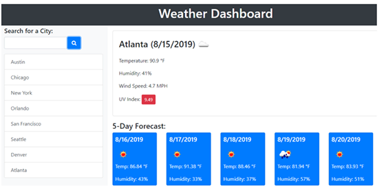

# Weather Dashboard

## Description:

This is a simple city weather dashboard.

## How to use?

1. User can enter a city at the search bar on the left.
Search history will also be shown on the page.

2. It will then show you the weather today. And also the forecast for the next 5 days.

3. The weather detail includes : 
- Current temperature
- Current humidity
- Wind Speed 
- UV index.

## Credits
1. The weather data is based on OpenWeather API (https://openweathermap.org/)
2. CSS framework: Bootstrap (https://getbootstrap.com/)